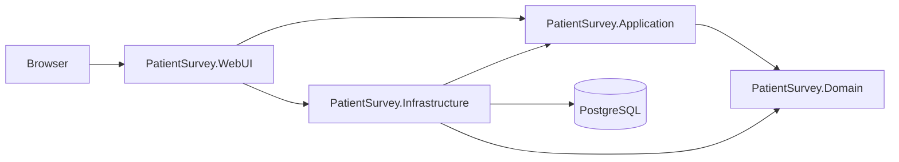
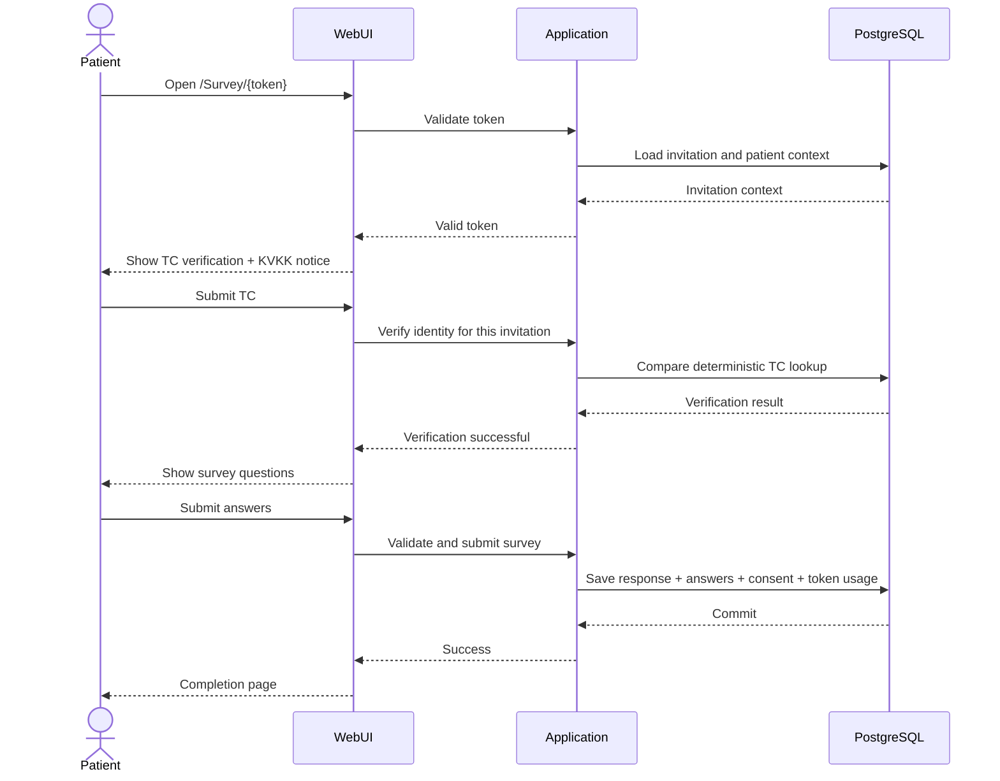

# Patient Satisfaction Survey System

A layered ASP.NET Core MVC application for creating patient-specific satisfaction surveys, delivering one-time survey links, verifying patient identity, and reviewing survey results with role- and permission-based access controls.

## Overview

The core patient-specific flow is:

```text
Patient
  -> PatientVisit
  -> SurveyInvitation
  -> SurveyAccessToken
  -> SurveyResponse
  -> Answer
```

A generated survey link is therefore not anonymous. It is associated with a patient, a visit, an invitation, and an access token.

## Features

- Patient-specific survey invitations and one-time access tokens
- General and doctor/department-targeted surveys
- Score, text, and boolean question types
- Patient visit tracking
- Link-only, SMS, and email delivery abstractions
- Patient identity verification before survey access
- KVKK notice step before questions are displayed
- Role-based Admin, Manager, and Doctor areas
- User-specific `CanViewPatientPersonalData` permission
- Doctor-scoped surveys, questions, visits, results, and tokens
- Audit logging for sensitive administrative operations
- PostgreSQL persistence with Entity Framework Core
- Docker and Docker Compose support
- Unit and integration tests

## Tech Stack

| Layer               | Technology                         |
| ------------------- | ---------------------------------- |
| Backend             | ASP.NET Core MVC / .NET 10         |
| UI                  | Razor Views, HTML, CSS, JavaScript |
| ORM                 | Entity Framework Core 10           |
| Database            | PostgreSQL 16                      |
| PostgreSQL Provider | Npgsql                             |
| Authentication      | ASP.NET Core Cookie Authentication |
| Testing             | xUnit                              |
| Containers          | Docker, Docker Compose             |

## Architecture

The solution follows a layered architecture with dependency inversion between the application and infrastructure layers.



### Project Structure

```text
Patient-Survey-System/
├── src/
│   ├── PatientSurvey.Domain/
│   ├── PatientSurvey.Application/
│   ├── PatientSurvey.Infrastructure/
│   └── PatientSurvey.WebUI/
├── tests/
│   ├── PatientSurvey.UnitTests/
│   └── PatientSurvey.IntegrationTests/
├── Dockerfile
├── docker-compose.yml
├── .env.example
└── PatientSurvey.slnx
```

- `PatientSurvey.Domain` contains domain entities and enums.
- `PatientSurvey.Application` contains DTOs, interfaces, application services, and business workflows.
- `PatientSurvey.Infrastructure` contains EF Core persistence, repositories, migrations, hashing services, and delivery implementations.
- `PatientSurvey.WebUI` contains MVC controllers, Razor views, authentication/authorization, session-based survey verification, and dependency injection composition.
- `PatientSurvey.UnitTests` contains isolated application/domain tests.
- `PatientSurvey.IntegrationTests` contains MVC, authorization, and persistence integration tests.

## Survey Model

### General Survey

A general survey is not tied to a doctor or department:

```text
Survey.DoctorId = null
Survey.DepartmentId = null
```

It is still delivered through a patient-specific invitation.

### Targeted Survey

A targeted survey is associated with a doctor and department. The doctor must belong to the selected department.

## Roles and Access

| Role      | Main capabilities                                                                                                                                                                                                               |
| --------- | ------------------------------------------------------------------------------------------------------------------------------------------------------------------------------------------------------------------------------- |
| `Admin`   | Manage users, permissions, doctors, departments, surveys, questions, patient visits, invitations/tokens, results, and system history.                                                                                           |
| `Manager` | View patient visits, survey results, reports, and invitation/token status. Patient personal data is shown only when the user has the required permission.                                                                       |
| `Doctor`  | Work within the assigned doctor/department scope: manage own surveys and questions, create patient-specific invitations, and view own scoped visits, results, and tokens. Patient details are restricted in doctor visit views. |
| `Patient` | No account is required. The patient opens the invitation link, verifies identity, reviews the KVKK notice, completes the survey, and submits once.                                                                              |

### Patient Personal Data Permission

Patient personal data visibility is controlled separately from the role through:

```text
CanViewPatientPersonalData
```

- The permission is assigned to individual users.
- It is not automatically granted to Admin or Manager users.
- Doctor users cannot be granted this permission.
- Without the permission, patient personal data should not be returned merely to be hidden in the UI.
- Raw T.C. Identity Number is not a displayable field even when this permission is granted.

## Patient Survey Access Flow



The verification state is stored server-side; raw TC is not stored in the verification session.

## Privacy and Security

### T.C. Identity Number

The application does not store T.C. Identity Number in plaintext.

Patient identity lookup uses a deterministic HMAC value generated from a secret key. This allows the same patient to be matched again without keeping a recoverable TC value in the database.

The identity key is configured through:

```text
PATIENT_IDENTITY_KEY
```

Use a strong secret and never commit the real key.

### Authentication and Authorization

- Cookie-based authentication
- Role-based authorization for Admin, Manager, and Doctor areas
- Server-side authorization checks
- Anti-forgery validation on state-changing MVC actions
- HttpOnly authentication and session cookies
- Production HSTS and centralized error handling
- Survey identity verification rate limiting

The current survey identity rate limiter allows up to 5 requests per 5-minute fixed window, partitioned by survey token when available and otherwise by client IP.

### Logging

Sensitive values should not be written to application or audit logs, including:

- Raw TC
- TC lookup hashes
- Phone numbers
- Email addresses
- Passwords and password hashes
- Full survey tokens
- HMAC keys
- Database passwords or other secrets

Audit records should identify the action and actor without copying sensitive patient values into the log.

## Delivery

Survey invitations support:

- `LinkOnly`
- `Sms`
- `Email`

A survey link is generated independently of the external delivery provider.

The current infrastructure uses development SMS and email sender implementations. They do not send real messages and may report delivery as `NotConfigured`. Replace them with production implementations of the existing sender abstractions when integrating a real provider.

## Configuration

### Docker Environment

Copy the example environment file:

```bash
cp .env.example .env
```

Windows PowerShell:

```powershell
Copy-Item .env.example .env
```

Configure local values:

```env
POSTGRES_DB=patient_survey
POSTGRES_USER=patient_survey_app
POSTGRES_PASSWORD=replace-with-a-local-secret
PATIENT_IDENTITY_KEY=replace-with-at-least-32-random-characters
```

Do not commit `.env`.

### ASP.NET Core Configuration

The application expects the PostgreSQL connection string at:

```text
ConnectionStrings:DefaultConnection
```

For local development outside Docker, user secrets can be used:

```bash
dotnet user-secrets --project src/PatientSurvey.WebUI set "ConnectionStrings:DefaultConnection" "Host=localhost;Port=5432;Database=patient_survey;Username=patient_survey_app;Password=YOUR_PASSWORD"
dotnet user-secrets --project src/PatientSurvey.WebUI set "PATIENT_IDENTITY_KEY" "YOUR_LONG_RANDOM_KEY"
```

Use the same PostgreSQL credentials as your local database or `.env`.

## Getting Started

### Prerequisites

- .NET 10 SDK
- Docker Desktop or another Docker/Compose-compatible runtime
- `dotnet-ef` for migration commands

If needed:

```bash
dotnet tool install --global dotnet-ef
```

### 1. Clone

```bash
git clone https://github.com/baturalpkahveci/Patient-Survey-System.git
cd Patient-Survey-System
```

### 2. Create Local Environment Configuration

```bash
cp .env.example .env
```

Set a local PostgreSQL password and a strong `PATIENT_IDENTITY_KEY`.

### 3. Start PostgreSQL

```bash
docker compose up -d db
```

PostgreSQL is exposed on `127.0.0.1:5432` for host-side tools such as pgAdmin and EF Core CLI.

### 4. Configure Host-Side Secrets

```bash
dotnet user-secrets --project src/PatientSurvey.WebUI set "ConnectionStrings:DefaultConnection" "Host=localhost;Port=5432;Database=patient_survey;Username=patient_survey_app;Password=YOUR_PASSWORD"
dotnet user-secrets --project src/PatientSurvey.WebUI set "PATIENT_IDENTITY_KEY" "YOUR_LONG_RANDOM_KEY"
```

### 5. Apply Database Migrations

```bash
dotnet ef database update --project src/PatientSurvey.Infrastructure --startup-project src/PatientSurvey.WebUI
```

### 6. Build and Test

```bash
dotnet restore PatientSurvey.slnx
dotnet build PatientSurvey.slnx
dotnet test PatientSurvey.slnx
```

### 7. Run with Docker Compose

```bash
docker compose up --build
```

Open:

```text
http://localhost:8080
```

The WebUI container connects to PostgreSQL using the Compose service name `db`.

## Local Development Without the WebUI Container

After PostgreSQL and user secrets are configured:

```bash
dotnet run --project src/PatientSurvey.WebUI
```

Use the URL printed by ASP.NET Core in the terminal.

## Database Migrations

Create a migration:

```bash
dotnet ef migrations add MigrationName --project src/PatientSurvey.Infrastructure --startup-project src/PatientSurvey.WebUI --output-dir Persistence/Migrations
```

Apply migrations:

```bash
dotnet ef database update --project src/PatientSurvey.Infrastructure --startup-project src/PatientSurvey.WebUI
```

To completely reset the Docker development database:

```bash
docker compose down -v
```

This removes the PostgreSQL Docker volume and deletes the local containerized database data.

## Tests

Run all tests:

```bash
dotnet test PatientSurvey.slnx
```

Unit tests only:

```bash
dotnet test tests/PatientSurvey.UnitTests
```

Integration tests only:

```bash
dotnet test tests/PatientSurvey.IntegrationTests
```

The solution uses xUnit for both test projects.

## Production Notes

Before using the system in a production healthcare environment:

- Replace development SMS/email sender implementations with real provider integrations.
- Store database credentials and `PATIENT_IDENTITY_KEY` in an appropriate secret-management system.
- Configure HTTPS/TLS at the deployment boundary.
- Define backup, restore, retention, and monitoring procedures.
- Review authorization and audit requirements for the actual institution.
- Have the KVKK notice, legal basis for processing, retention periods, recipients, and any explicit-consent requirements reviewed by the institution's authorized legal/KVKK team.

This repository is a software project and does not provide legal advice.
